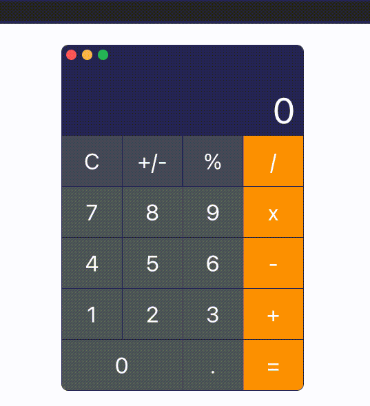

## About

This is small GitHub repo with apps, which I developed with purpose to test different libraries and packages and keep myself busy

## 1. macOS Calculator replication

Short project, where I created calculator app based on macOS calculator layout and color schema. Colors may be a bit distorted because of conversion from video file to GIF.

